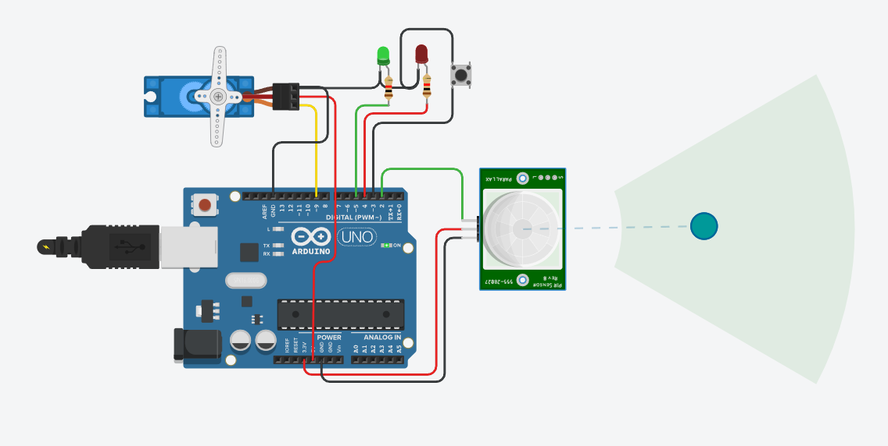

# 🔓 Automatic Door Opener using Arduino Uno and PIR Sensor

This project demonstrates a simple **automatic door opener** system using an **Arduino Uno**, a **PIR motion sensor**, and a **servo motor**. When motion is detected near the door, the servo motor opens the door automatically, provides visual and audible feedback using LEDs and a buzzer, and then closes the door after a short delay.

---

## 📦 Components Used

- Arduino Uno
- PIR Motion Sensor (HC-SR501 or equivalent)
- Servo Motor (SG90/MG90S)
- Buzzer
- Red LED
- Green LED
- Push Button (optional for manual override)
- Resistors (220Ω for LEDs)
- Breadboard and jumper wires
- USB cable for programming and power

---

## 🛠️ Working Principle

1. **PIR Motion Detection**  
   The PIR sensor continuously monitors for motion within its field of view.

2. **Servo-Based Door Movement**  
   When motion is detected, the servo motor rotates to simulate door opening (typically 90°), waits for a few seconds, and returns to its original position (0°) to close the door.

3. **Visual and Audible Feedback**  
   - Green LED turns on during motion detection and door open.
   - Red LED remains on when no motion is detected (door closed).
   - Buzzer provides a short beep as an alert when the door is activated.

4. **Optional Button Control**  
   A push button can be added as a manual trigger or override.

---

## ⚡ Circuit Diagram

All connections are made on a breadboard. The key connections are:

| Component        | Arduino Pin     |
|------------------|------------------|
| PIR Sensor OUT   | D2               |
| Servo Signal     | D9               |
| Red LED (+)      | D4 (via 220Ω)    |
| Green LED (+)    | D5 (via 220Ω)    |
| Buzzer (+)       | D6               |
| Button (optional)| D3               |
| VCC (PIR/Servo)  | 5V               |
| GND              | GND              |

---

## 🚀 Getting Started

1. Connect the components as per the circuit diagram.
2. Upload the provided Arduino code to your Uno board.
3. Power the system using USB or external 5V source.
4. Once motion is detected, the servo opens the door and closes it automatically.

---

## 📷 Project Preview

---

## 🧠 Applications

- Contactless smart doors
- Office or home automation
- Touch-free restroom entry systems
- Energy-saving automatic gates

---

## 📝 Future Improvements

- Integrate an ultrasonic sensor to detect object distance
- Use IoT (e.g., ESP8266 or ESP32) for remote control/monitoring
- Add LCD/OLED display for status
- Connect to a database for access logging
